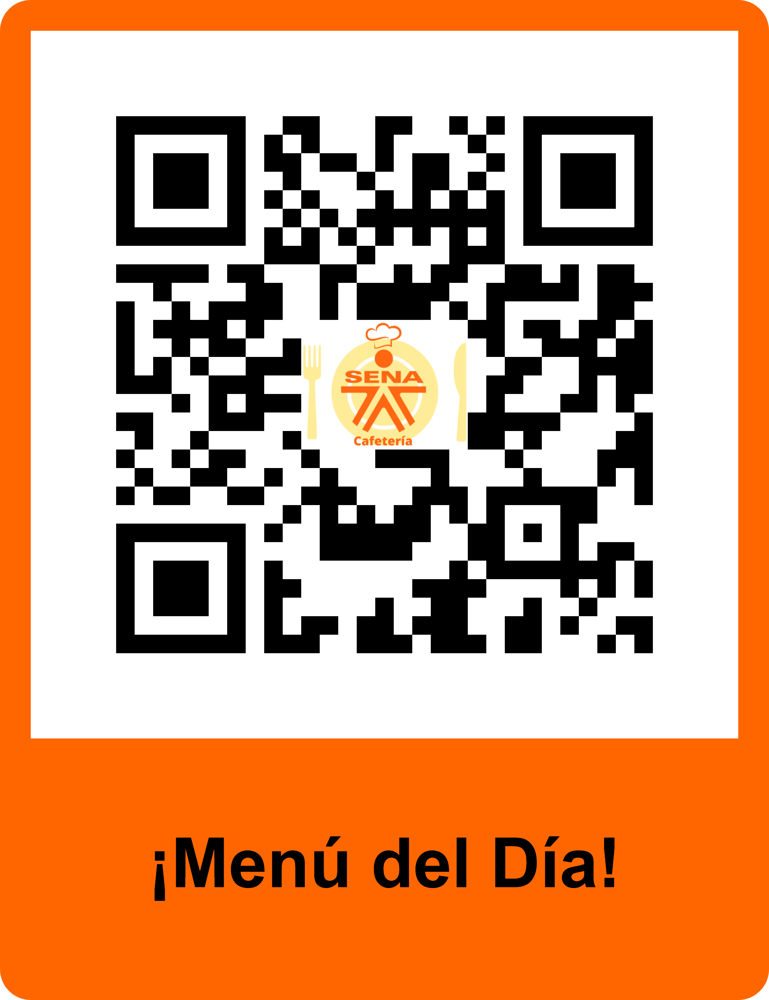
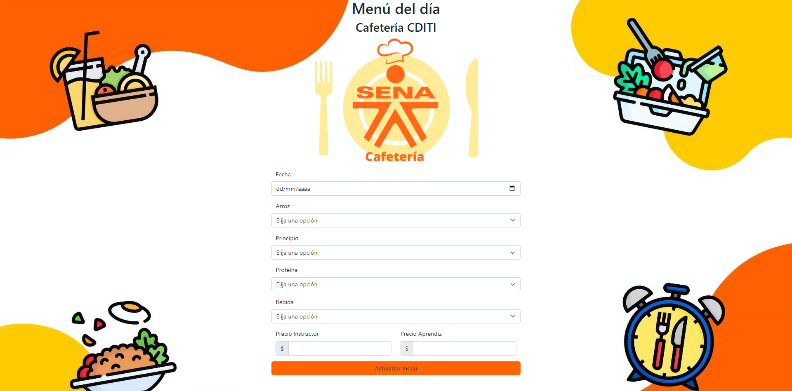
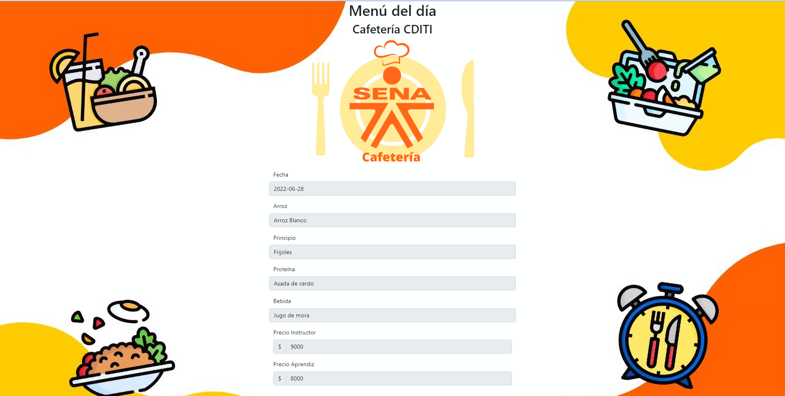

Menú Virtual Cafetería CDITI

Este proyecto se creo con la finalidad de que tanto aprendices como instructores del CDITI tengan acceso al menú del almuerzo del dia en la cafetería. En él, el personal de la cafetería puede actualizar diariamente que será el almuerzo, para que por medio de cualquier dispositivo los clientes puedan tener acceso a la información, sin tener que dirigirse directamente al punto de venta.

Link demo:

https://menuvirtual.diana-victoria1.repl.co

Modo de acceso: 

La forma de acceder al menú será a través de un código QR, uno que desplegará la información para ser leida por los clientes y otro en el cual el personal de la cafeteria puede actualizar la información.
.png)

Modo de uso:

Personal de la cafetería:

1.Ingresar a la página donde se encuentra el formulario.

2.Llenar cada campo con la información actualizada del día: fecha, tipo de arroz, principio, proteína, bebida y precios.

3.Actualizar información dando click en el botón "Actualizar menú".

Vista previa:

Clientes:

1.Ingresar por medio del código QR.

2.Leer la información.

Vista previa:

